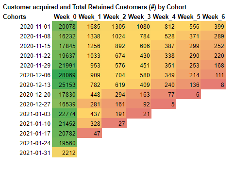
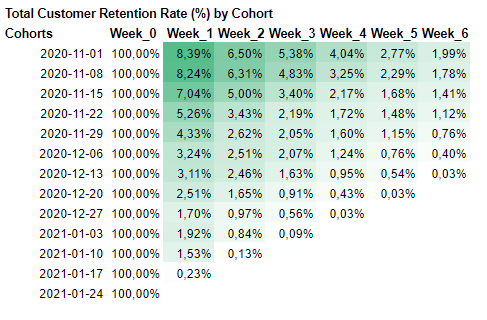
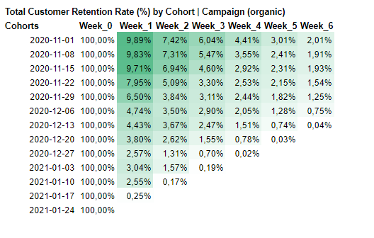
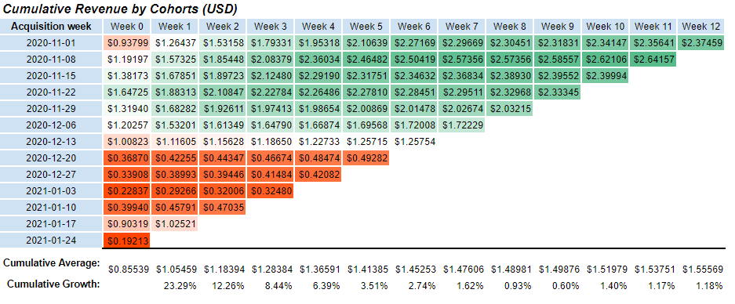
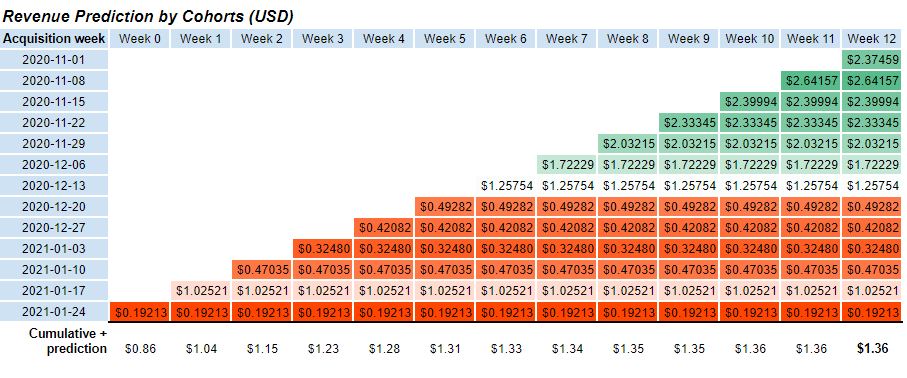
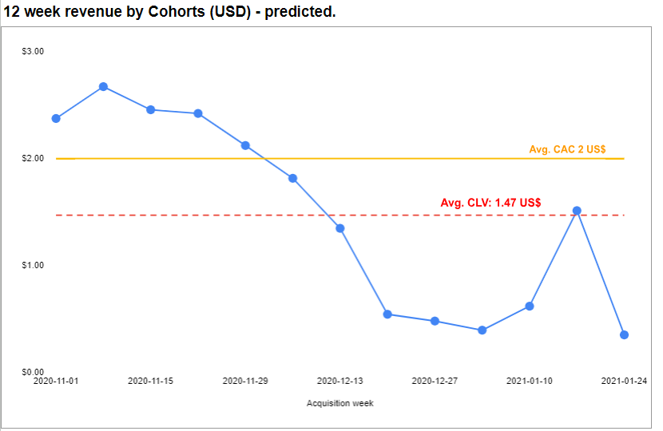

# E-commerce Retention and CLV Analysis: Predicting Customer Behavior Using Cohorts

## Overview
This project analyzes customer retention, churn rate and customer lifetime value (CLV) for the Google Merch Shop.
Project measures customer behaviour on a weekly basis, also predicting customer lifetime value.

# Problems

* **Customer Retention** How many customers return to the shop after their first visit and how does this change over time?
* **Customer lifetime value (CLV)** How much revenue can a shop expect to earn from a customer over a time? How does this different from other cohorts?
* Is the current Customer Lifetime Value **(CLV)** and Customer Acquisition Cost **(CAC)** of $2 **ratio** acceptable?

### Content
* Access analysis in [Google Sheets](https://docs.google.com/spreadsheets/d/1Q0kidTvBP4y6cf4Sz3ZcM41sMjVjV8XaTtogu0Ki_44/edit?usp=sharing);
* `data/` folder contains data analysed;
* `code` access queries used to extract data and aggregate for the analysis

### Tools:
* Bigquery
* Google Sheets

### Analysis Process

1. Data exploration. Cheking if there is no outliers (using IQR), missing data in dataset as for CLV analysis revenue has to be correct. Validating results for cohorts, how many visitors are expected.
2. **Cohort formation**. Customers grouped by week, first week is week0, week starting from Sunday. 
3. **CLV analysis**. Analysing revenue by weekly cohorts, calculating the average weekly revenue per cohort (in USD) and using cumulative revenue growth over time to estimate the customer lifetime value (CLV) for each cohort.

## Findings 

1. Overall it is visible that most customers acquired on 2020-12-06 week, before the holidays. Over time retention tends to drop *(see Figure 1)*. 

*Figure 1. "Customers Acquired and Total Retained Customers (#) by Cohort"*

2. A significant drop-off in customer retention is observed in the first week, with only a small percentage of customers returning by Week 6. However, it is visible that customers that in were acquired before holidays, in earlier cohorts and before high acquisition tends to retain more than holiday customers. It is worth investigating what percentage of customers came through organic vs. other campaigns *(see Figure 2)*.

*Figure 2. "Total Customer Retention Rate (%) by Cohort"*

Down below is the retention rates for the customers that first visited website through organic campaign, there we can see that during holiday period retention rates are higher than we see overall.

 

*Figure 2.1. "Total Customer Retention Rate (%) by Cohort | Campaign (organic)"*

3. Customer acquired before the holiday period, generate more revenue over time compared to those acquired during the holidays. Revenue growth is highest until Week 4 and slows down after week 4 *(see Figure 3)*.

*Figure 3. "Cumulative Revenue by Cohorts (USD)" calculated using weekly revenue data.*

4. Only customers acquired before the holiday period (before the week of December 6th) have predicted CLV higher than the CAC. Overall, the average CLV of \$1.47 compared to CAC of \$2 indicates that the company loses 0.53$ for every customer, leading to negative profit margin *(see Figure 4)*.

*Figure 4. "Revenue Prediction by cohorts."*

5. Eight customer cohorts are below average CAC of 2$. Break from 2020-12-06 cohort week. Interestingly CLV rise on 2021-01-17 week cohort, suggesting limitations of holiday period, however still needs to be investigated *(see Figure 5)*.

*Figure 5. "Revenue Prediction by cohorts."*

# Recommendations

1. Use targeted marketing strategies to retain customers acquired during peak periods.
2. Improve Acquisition Strategies: Focus on acquiring customers through organic channels, as data suggests they tend to retain better than those acquired through paid campaigns. Consider investing more in SEO and content marketing.
3. Adjust CAC: the Customer Acquisition Cost (CAC) and Customer Lifetime Value (CLV) ratio is suggested to be 3:1, meaning the CLV should be 3 times the CAC. If CAC remains higher than CLV, check other acquisition strategies.

## Limitations

1. The analysis is based on historical data, which may not account for future changes in customers behavior, market changes, competitors approach etc. 
2. The analysis conducted during seasonal time, which may not be very representative.
3. Google Merch Shop is considered to be more of a advertising, promotional shop rather than main revenue source, so relatively low revenue is not the most important metric, focus on acquisition.